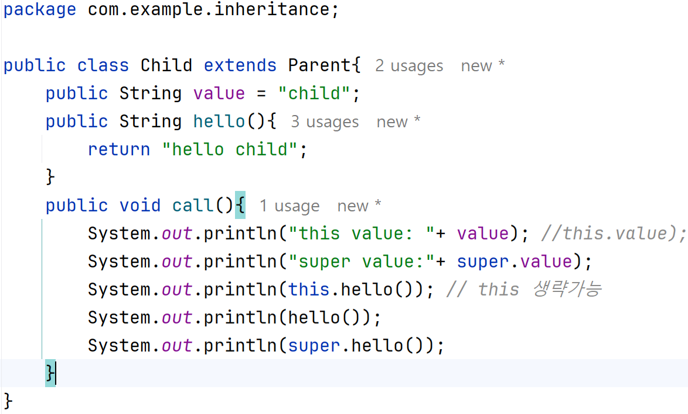

# 상속
## inheritance 패키지 만듭니다.
### ElectricCar, GasCar 클래스 작성
#### 클래스에는 멤버변수 와 메서드 가 있습니다.
- ElectricCar : go(), charge()
- GasCar : go(), fillUp()
> 여기서, 주행하다는 공통해위이고 연료를 주입하는 방법은 다르다.
> 좀더 추상적인 Car 클래스 만들고, go() 가지면된다.
##### class ElectricCar extends Car{ ...}
> 자바는 단일 상속만 허용합니다.
> 부모클래스(super 클래스)
> 자식클래스(sub 클래스)
> 상속 키워드는 extends의 대상은 하나이다.(단일 상속)
> 자식은 부모가 누구인지 알지만 부모는 자식을 모릅니다.
> interface 는 다중구현을 허용 합니다. 
##### 상속과 메모리 구조
- 상속관계의 객체를 생성하면 부모와 자식의공간이 구분되어 생성된다.
- 현재 타입에서 기능을 찾지 못하면 상위 부모 타입으로 기능을 찾아 실행한다. 
- 만약 부모에게도 기능을 찾을 수 없으면 컴파일 오류가 발생.

> new ElectricCar()호출하면 상속관계에 있는 Car까지 포함해서 인스턴스를 생성한다.
> 부모도 생성되고 본인꺼도 생성된다. 공간은 구분되어 생성된다.

> ec.injectFuel()호출하면 먼저 자신에게 있는메서드이면 자신 것을 실행하고,
> 없으면 부모에게 찾아본다. 있으면 부모가 가진 메서을 실해하고,
> 부모에 없으면 컴파일 에러 납니다.
>
> ##### 상속은 새로운 자동차로 확장(extends)할 수 있고
> ##### 부모에 기능을 추가하면 자식들이 그 혜택을 봅니다.
> #### method override (메서드 오버라이드)
> 자식이 새롭게 메서드를 재정의 한다.(상속관계에서 부모의 기능을 자식이 덮어버린다.)
##### 메서드 오버라이딩 조건
> 부모 메서드와 이름, 매개변수 타입, 순서, 개수가 같아야 합니다.
> return type 도 같아야 합니다.
> 접근제어자는 부모 클래스의 메서드보다 자식이 더 넓어야 한다.
> static(클래스 레벨), final(메서드 고칠수 없다), private(숨겨진다. 외부에서 보이지 않는다.)메서드는 오버라이딩 할 수 없다.
> 생성자는 오버라이딩 할 수 없다. 
##### 접근제어자(UML표기) 종류
- private ( - ) : 모든 외부 호출을 막는다.
- default ( ~ ) : 같은 패키지 안에서 호출이 허용된다.
- protected ( # ) : 같은 패키지 안에서 호출된다. 단, 패키지가 달라도 상속관계는 호출가능하다.
- public ( + ): 모든 외부 호출이 허용된다.
> 순서대로 private이 가장 많이 차단하고 public이 가장 많이 허용한다.
> 본인 타입에 기능이 없으면 부모 타입에서 기능을 찾는데 이때 접근 제어자가 영향을 준다. 
> 자신의 타입이 부모 타입보다 허용범위가 넓어야한다.

##### 부모 클래스에 대한 참조 : super
- 부모와 자식의 필드명이 같거나 메서드가 오버라이딩 되어 있으면
- 자식에서 부모의 필드나 메소드를 호출 할 수없을때 
- super 키워드를 사용하면 부모를 참조할 수 있다.

> this는 나의 type에서 찾는다. 
> this를 생략하면 내의것에서 찾고 없으면 부모에서 찾는다
> super는 부모타입에서 찾습니다.
##### 부모 생성자 참조 : super()
- 자식클래스의 생성자에서 부모클래스의 생성자는 반드시 호출 해야 한다(규칙)
- 상속 관계에서 부모의 생성자를 호출할때는 super()을 사용합니다.

